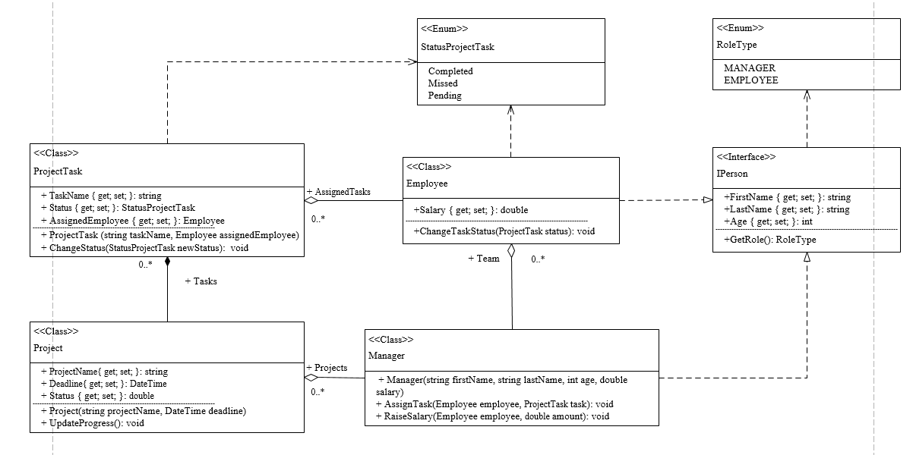

<h1 align="center">Система Управління Проектами</h1>

## Опис предметної області

**Система управління проектами** розроблена для керування співробітниками, проектами, завданнями та ролями в організації. Основними сутностями системи є **Менеджер**, **Співробітник**, **Проект** та **Завдання**. Кожна з цих сутностей має свої зв'язки та відповідальності, що дозволяє ефективно планувати проекти, призначати завдання та відстежувати прогрес.

### Співробітники

**Співробітники** — це особи, що працюють у системі. Кожен співробітник має особисту інформацію, таку як **ім'я**, **вік** та **зарплата**, а також список завдань, які йому призначені. Співробітники також мають **роль**, яка може бути або звичайним співробітником, або менеджером.

- **Призначені Завдання**: Співробітники мають завдання, які їм призначають менеджери.
- **Статус Завдання**: Співробітники можуть змінювати статус завдання (наприклад, з "Очікується" на "Виконано").

### Менеджери

**Менеджери** відповідають за управління проектами та завданнями. Вони призначають завдання співробітникам, змінюють їх зарплату та відстежують прогрес проектів.

- **Команда**: Менеджер керує командою співробітників і може призначати їм завдання.
- **Проекти**: Менеджери контролюють кілька проектів і слідкують за їхнім прогресом.

### Проекти

**Проекти** — це ініціативи або набір завдань, які повинні бути виконані протягом певного часу. Проект має **назву**, **термін виконання** та **статус**.

- **Завдання**: Проект складається з кількох завдань, які повинні бути виконані.
- **Прогрес**: Прогрес проекту визначається виконанням завдань, які призначені співробітникам.

### Завдання

**Завдання** є основними компонентами проектів. Це окремі елементи роботи, які повинні бути виконані співробітниками. Завдання мають різні **статуси**, такі як **Очікується**, **Виконано** або **Пропущено**, і співробітники можуть змінювати статус цих завдань в залежності від прогресу.

- **Призначений Співробітник**: Кожне завдання призначене співробітнику менеджером.
- **Прогрес**: Кожне завдання має індикатор прогресу, який показує, скільки з завдання було виконано.

## Взаємозв'язки між сутностями

1. **Менеджер-Співробітник**: Менеджер може мати кілька співробітників в команді. Менеджер призначає завдання співробітникам та може змінювати їх зарплату.
2. **Менеджер-Проект**: Менеджер відповідає за один або кілька проектів. Менеджер контролює прогрес кожного проекту.
3. **Співробітник-Завдання**: Співробітник може мати кілька завдань. Співробітник працює над ними, змінюючи їхній статус за мірою виконання.
4. **Проект-Завдання**: Проект складається з кількох завдань, кожне з яких впливає на загальний прогрес проекту.

## Діаграма класів

